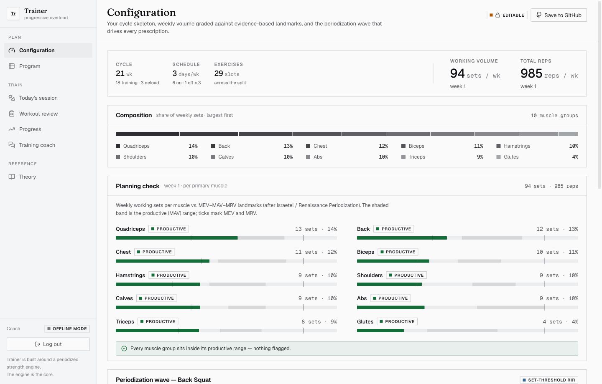
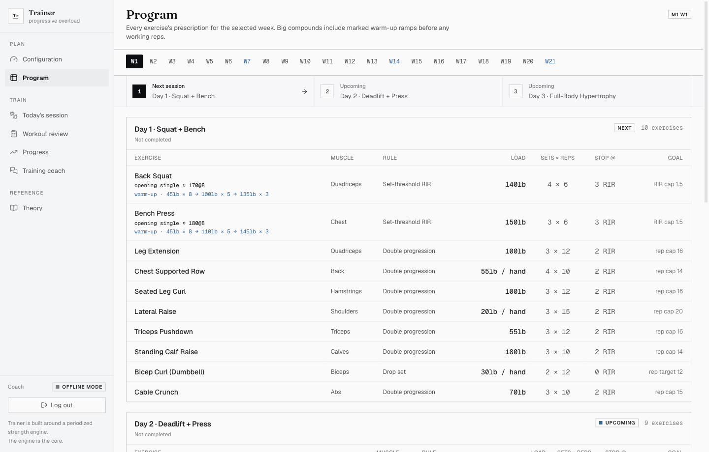
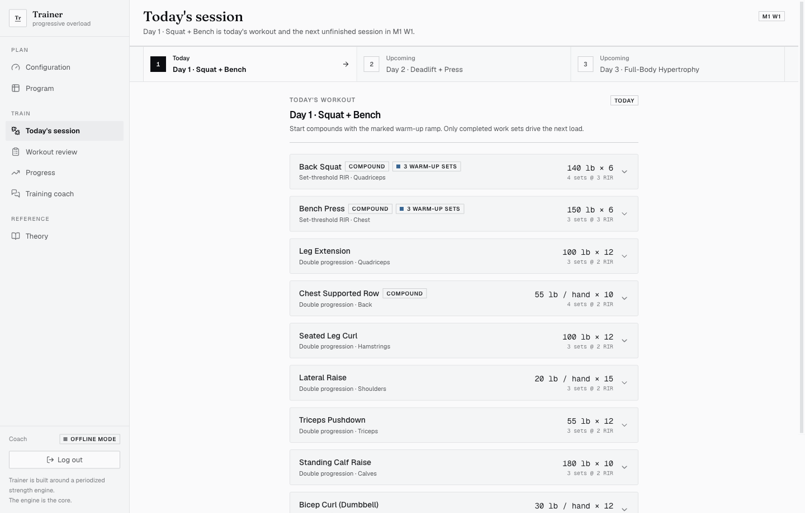
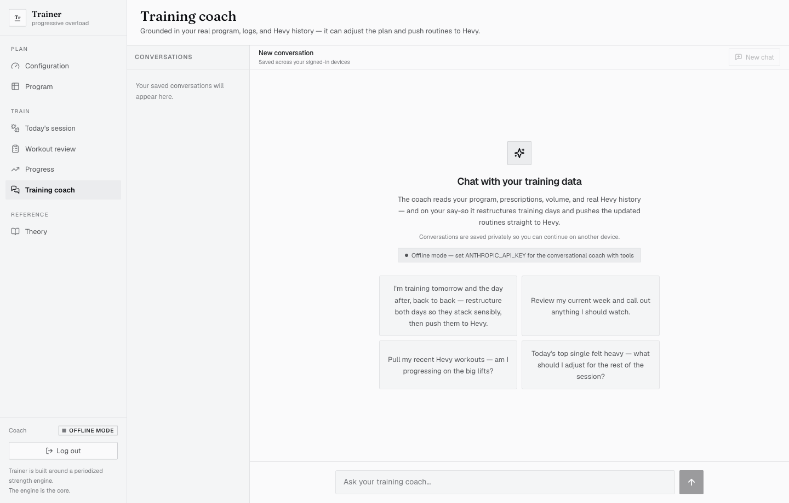
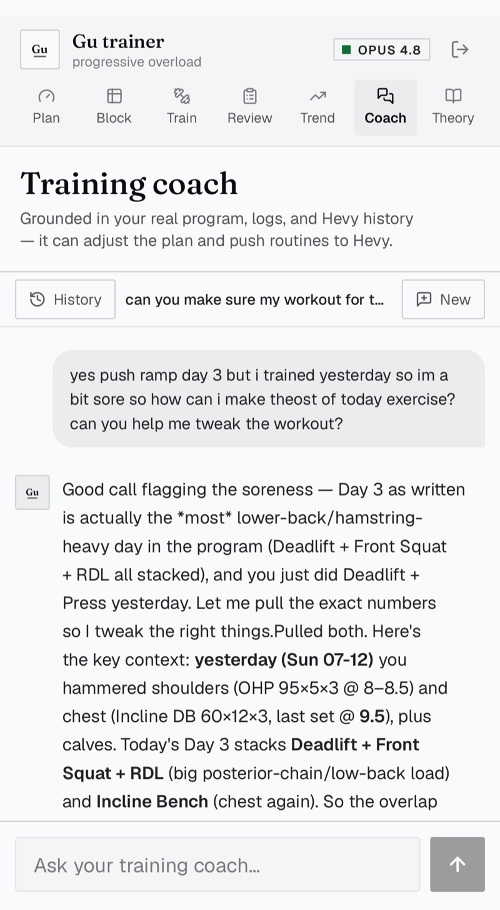
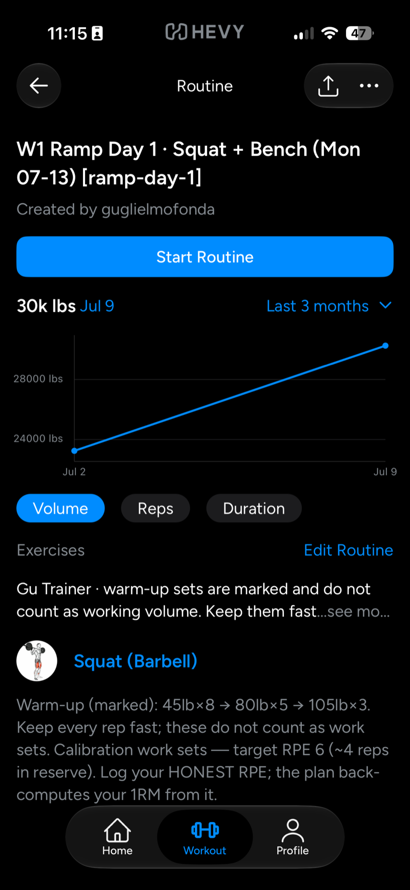
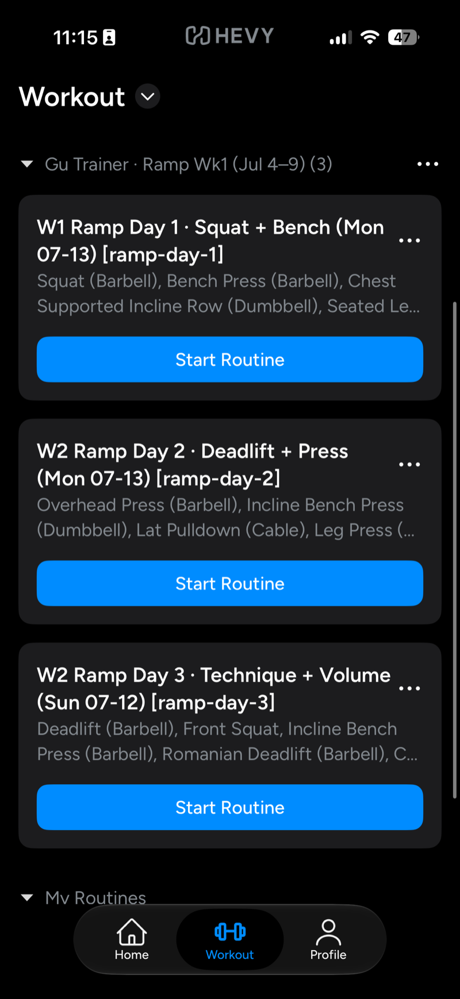

# Trainer — a progressive-overload strength platform

Shoutout to [Matt Palmer](https://x.com/mattyp/status/2070129458305257746) — this
started as a faithful re-implementation of the web dashboard he walks through in
his "personal software" video (rebuilt from the transcript and frame-by-frame
screen captures of the original), then took it a step further with a full
[Hevy](https://hevy.com) integration: automatic sync, scheduled pulls, webhooks,
and routine pushes.

The brief was explicit: **the backend — the thinking, theory, and rationale behind
the trainings — is the core.** So that's where the work went. The
[`lib/engine/`](lib/engine/) directory is a pure, dependency-free, fully-tested
TypeScript library that encodes the training science; the Next.js UI, the
persistence layer, and the AI coach are thin shells around it.

> Read [`docs/THEORY.md`](docs/THEORY.md) first — it's the point of the project.
> Then [`docs/ARCHITECTURE.md`](docs/ARCHITECTURE.md) for how it's wired.

## This is a template

Click **Use this template** on GitHub to get your own copy — fresh history,
and your training data stays yours (keep your copy **private**: the app
commits your program and workout history to the repo by design). Then open
your copy in a coding agent (Claude Code, Cursor, …) and say:

> **"Read AGENT.md and onboard me."**

[`AGENT.md`](AGENT.md) is a full onboarding runbook: the agent interviews you
(name, schedule, starting weights, preferences), personalizes the app, builds
your program, connects Hevy and the AI coach if you want them, and walks you
through deployment. Everything personal — names, branding, monogram — is
driven by `data/profile.json`, so no code changes are needed to make it yours.

## What it looks like

A fresh clone, default branding, seeded example program — this is `npm run dev`
before any configuration:

**Configuration — the planning check.** Cycle shape, weekly volume per muscle
graded against the MEV/MAV/MRV landmarks, and the composition of the split.



**Program — every prescription for the selected week.** Big compounds carry
marked warm-up ramps; autoregulated lifts re-scale to the opening single on the
day.



**Today's session.** Log a heavy opening single @ RPE 8 and the work sets
re-scale live; completed sets drive next week's loads.



**Training coach.** Reads your program, volume, and Hevy history; edits the
plan and pushes routines on your say-so. Without an API key it degrades to the
deterministic offline mode shown here.



**On the phone — and in Hevy.** The web app is responsive, so mid-gym coaching
works from a pocket (left: the coach on mobile, from the author's live
instance). The other two are the Hevy side of the integration: pushed routines
land titled by week and day, foldered per block, with warm-ups marked and the
prescription's RPE targets in the notes.

<p align="center">
  
  
  
</p>

## What it does

- **Configuration / planning check** — build a cycle ("6 on / 1 off · 3 mesos"),
  set exercises with an estimated 1RM, a periodization *wave*, and a progression
  *rule*; see weekly volume per muscle graded against MEV / MAV / MRV landmarks and
  the composition by muscle group.
- **Program** — the full week-by-week grid; for autoregulated lifts the loads
  re-scale to your opening single on the day.
- **Today's session** — log a heavy *opening single @ RPE 8*; the work sets
  re-scale live to how strong you are today; log them and the engine computes next
  week (e.g. "4/4 quality sets → +10 lb, reps reset").
- **Marked compound warm-ups** — squat, bench, deadlift, press, and major variants
  get progressive, low-fatigue ramp sets that export to Hevy as `warmup`, never as
  working volume.
- **Training coach** — Claude Opus 4.8 reading your program, prescriptions, volume,
  and logs ("all this training is, is context"). Conversations are saved privately
  and resume across signed-in devices. Degrades to a deterministic read when no API
  key is set.
- **Automatic Hevy sync** — Progress and Workout review read directly from
  [Hevy](https://hevy.com) whenever they open, and the coach pulls live history
  on request. The server owns the connection; the athlete never pastes an API
  key or runs a separate import/refresh flow. See [`docs/HEVY.md`](docs/HEVY.md).

## The engine (the core)

Pure TypeScript, no framework, no I/O — so the theory is testable in isolation:

| File | Responsibility |
|---|---|
| `lib/engine/e1rm.ts` | RPE/RIR ⇄ %1RM math; e1RM estimation (the basis of autoregulation) |
| `lib/engine/periodization.ts` | wave generator → week-by-week reps/sets/RIR/intensity |
| `lib/engine/prescription.ts` | opening single → e1RM → working load |
| `lib/engine/rules/` | the 10 named progression algorithms + evidence cards |
| `lib/engine/analysis.ts` | volume landmarks, planning check, composition |
| `lib/domain/` | volume landmarks + the reconstructed seed program |

The periodization engine reproduces the back-squat wave table from the video
*exactly* for the first micro-wave and lands the final week on a heavy single —
verified in the test suite. The planning check lands at **80 sets / 889 reps** on
the reconstructed program (the video shows 81 / 905).

## Requirements

- **Node.js 20+** (22 LTS recommended — it's what CI runs) and **npm**.
- Nothing else. No database, no accounts, no API keys — the app seeds itself
  from the reconstructed program and stores everything in `data/store.json`.

Two integrations are optional and stay off until you add a key (see the
configuration table below): the conversational coach (Anthropic) and Hevy sync.

## Run it

```bash
git clone https://github.com/<you>/<your-copy>.git
cd <your-copy>
npm install
npm test            # 152 tests — validates the science against the video's numbers
npm run engine:demo # prints the periodization table, autoregulation, and planning check
npm run dev         # the app at http://localhost:3000
```

### Configuration (all optional)

Copy `.env.example` to `.env.local` and set what you need — every variable is
documented inline there. In short:

| Variable | What it enables |
|---|---|
| `ANTHROPIC_API_KEY` | The conversational Training coach. Without it the coach degrades to a deterministic read of your real program, logs, and volume analysis. |
| `HEVY_API_KEY` | Automatic [Hevy](https://hevy.com) sync and the `npm run hevy:*` scripts. From hevy.com → Settings → API (requires Hevy Pro). |
| `HEVY_WEBHOOK_SECRET` | The `/api/hevy/webhook` receiver, so Hevy pings the app after each saved workout. |
| `HEVY_WEBHOOK_AUTO_APPLY` | `"true"` to auto-apply confident starting-weight recalibrations after each workout (never touches a locked program). |
| `APP_PASSWORD` | Password-gates the app. Enforced on Vercel; off locally unless set. |
| `APP_SESSION_SECRET` | Signs the login cookie (falls back to `APP_PASSWORD`). |
| `BLOB_READ_WRITE_TOKEN` | Durable writes via Vercel Blob in production. Locally the same data lives in `data/store.json`. |

The server owns the Hevy connection — an API key is never requested or exposed
in the product UI. For the occasional maintenance task of recalibrating the
plan's starting anchors from history:

```bash
npm run hevy:import            # preview (no writes)
npm run hevy:import -- --apply # write the calibrated loads
```

### Where your data lives

`data/store.json` (program + logs), `data/profile.json` (name + branding), and
`reports/` are committed on purpose: **the repo is the database.** A fresh
clone ships none of them — the app seeds a worked-example program on first
run, and onboarding writes the profile. The scheduled Actions then commit your
Hevy history and daily report back to `main`. That's why your copy should stay
private.

## Hosting

It's a standard Next.js 15 app — it runs anywhere Node 20+ runs. The only real
decision is where writes go (see [`lib/store/`](lib/store/)).

**Vercel** (what this repo is set up for)

1. [Import the repo](https://vercel.com/new) or run `npx vercel`.
2. Set `APP_PASSWORD` — the login gate is enforced on Vercel so your training
   data isn't public.
3. Connect a [Blob store](https://vercel.com/docs/vercel-blob) to the project —
   the serverless filesystem is ephemeral, so durable program/log/coach writes
   go through `BLOB_READ_WRITE_TOKEN` (injected automatically when connected).
4. Optional: `ANTHROPIC_API_KEY`, `HEVY_API_KEY`, and the webhook variables.

**Any Node host** — Railway, Render, Fly.io, a VPS

`npm run build && npm start` (port via `PORT`). The JSON file store is the
source of truth here, so give `data/` a persistent disk or volume. Set
`APP_PASSWORD` explicitly — outside Vercel the gate is off until you do.

**Fully local / a home server**

`npm run dev`, or build + start behind Tailscale. Nothing phones home; for a
single athlete, localhost is a perfectly good deployment.

**The automation** ([`.github/workflows/`](.github/workflows/)) is scheduled
GitHub Actions, separate from the web deploy: a daily Hevy pull and a
Sunday-night weekly advance that commit updated state back to `main`. On a
fork, add `HEVY_API_KEY` (and optionally `BLOB_READ_WRITE_TOKEN`) as repository
secrets and enable the workflows — GitHub leaves scheduled workflows off in
forks until you do.

## Provenance

Rebuilt from the video's transcript and frame-by-frame captures. The engine is
validated in the test suite against ground-truth tables reconstructed from
those frames — the back-squat wave and the planning-check totals above.

## License

[MIT](LICENSE).

> Training software, not medical advice. The charts and volume landmarks are
> population guidelines, not laws.
